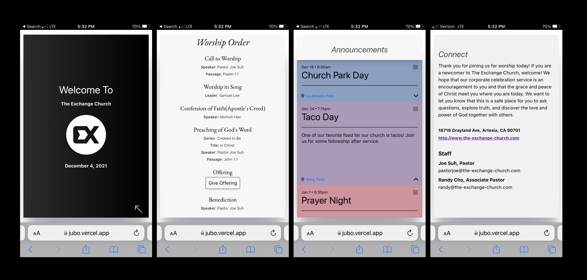

# JUBO-API

## Link

Client Side Web

[https://jubo.vercel.app/](https://jubo.vercel.app/)

Client Side Code

[https://github.com/gbertkim/jubo](https://github.com/gbertkim/jubo)

## Description

Jubo in Korean stands for handout or bulletin. I made this digital church bulletin for a local church that wanted to save time, paper, and money. 

Created to be minimal so that it does not distract church attenders and simple so that anyone from any age can use it. 

Designed to be easily updated weekly by copying prior bulletins.

The client side of this app is built using REACT. The backend is built using NODE and POSTGRESS which allows for CRUD operations.

To see the application in use look at: [https://jubo.vercel.app/jubo/gilbear](https://jubo.vercel.app/jubo/gilbear)

## Stack

HTML, CSS, JavaScript, JSX, React, Node, Postgres, Express, 

## Plug-ins
useSpring, useGesture

## Snapshots

Designed for mobile, users will scan a QR code before entering the church. Users will be noted to open a web app where they can see the worship order, add events to their calendars, save addresses to their google maps, and take note of the church's contact info. 

When you first enter the app, you will either log in or create an account. Be mindful that your username will also be the hyperlink or name of your bulletin board. Open the navigation through the hamburger to either logout or access your account page. In the account page you may delete or account or change your password. 

Create a bulletin for a specific date. After you create the bulletin, click "GO LIVE" if you'd like for it be active. Notice that the hyperlink to your bulletin is under "MY JUBOS". You may also copy, edit, rename, or delete the jubo as well. From their, update your bulletin contact by going into edit and updating the contents within

App is responsive. 